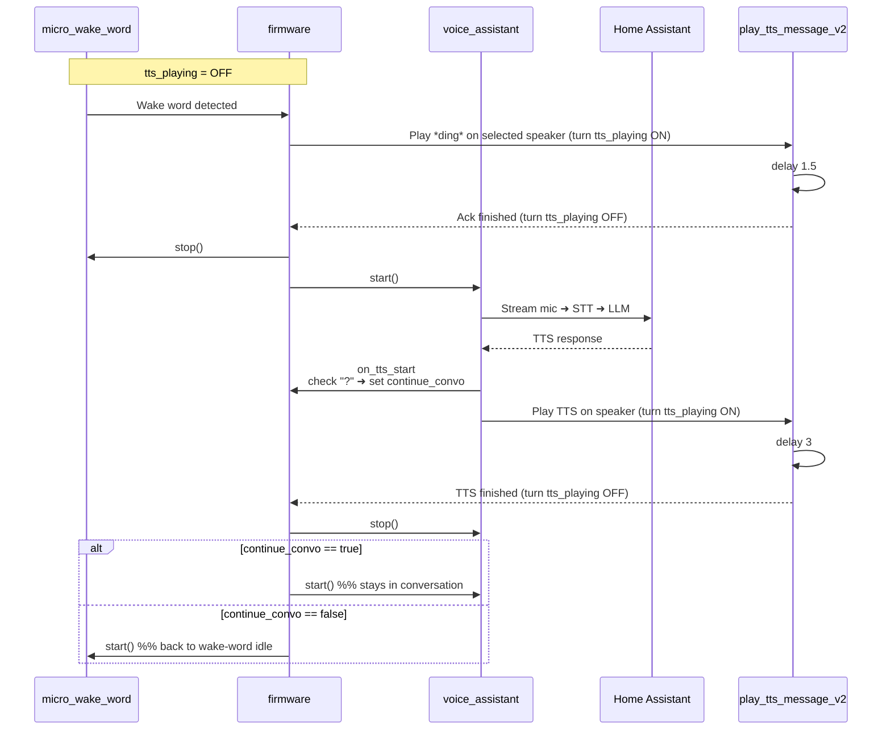

# Atom Echo – Continued-Conversation Satellite

> **Disclaimer**
> README generated by LLM  
> This firmware is a **proof of concept** and will not be a one‑click flash for most users.  
> You’ll need intermediate ESPHome & Home Assistant skills to:
> * Compile/flash your tweaked version of `atom_echo_firmware.yaml` to your Atom Echo  
> * Import and adjust `play_tts_message_v2.yaml` in Home Assistant  
> * Provide a “ding” / acknowledgement sound (host it yourself, reference its URL)  
> * Point the script at your own media‑player entities  
> * Fine‑tune any other substitutions (Wi‑Fi, encryption key, OTA password, etc.)

---

## Repository Contents

| File | Purpose |
|------|---------|
| **`atom_echo_firmware.yaml`** | ESPHome config for Atom Echo with MicroWakeWord and continued-conversation logic |
| **`play_tts_message_v2.yaml`** | HA script that plays TTS/ack audio, toggles `input_boolean.tts_playing`, inserts delays |

---

## Feature Highlights

* **Continued Conversation** – Automatically keeps the mic open for follow‑up questions when the response ends with a question mark.  
* *Attempts* **smart TTS gating** – The helper script turns **`tts_playing` on** before audio playback and **off** after a delay so the microphone ignores the speaker.  
* **Selectable response speaker** – Choose the output zone via the **Response Speaker** dropdown in the Atom Echo *device* config (`select.response_speaker`).  
* Single‑LED feedback: idle, listening, thinking, error.

For details on MicroWakeWord itself see <https://esphome.io/components/micro_wake_word.html>.

---

## Logic Flow

### Key Decision Points

| Stage | Condition / Check | Action |
|-------|------------------|--------|
| **on_wake_word_detected** | `tts_playing` must be **OFF** | Prevents re‑trigger during playback |
| **on_tts_start** | Response text ends with “?” | Sets global `continue_convo` |
| **on_end** | Wait until `tts_playing` is **OFF** | Then either restart **voice_assistant** (follow‑up) or **micro_wake_word** (idle) |

---

## The `tts_playing` Boolean

| State | Meaning | Set by |
|-------|---------|--------|
| **ON**  | Audio is currently playing; mic should be ignored | `play_tts_message_v2` **before** `media_player.play_media` |
| **OFF** | Safe to reopen mic / accept wake word | `play_tts_message_v2` after delay |

This simple helper keeps the Atom from hearing—and reacting to—its own voice.

---

## Script Delay Rationale

`media_player.play_media` is non‑blocking, so we inject a pause:

* **1.5 s** – quick acknowledgement ding  
* **3 s** – typical TTS sentence  

### Why not calculate the exact duration?

| Idea | Hurdle |
|------|--------|
| **Content‑Length (HTTP header) → duration** | Invoking a separate HTTP request inside the automation is messy. |
| **Bit‑rate & file size** | Even with VBR, file size would be close enough, but getting it from disk/URL inside an automation is tricky. |
| **Character count heuristic** | `on_tts_start` exposes the char count *before* the MP3 exists; the script runs in `on_tts_end`, so passing the value across events is non‑trivial. |

If you devise a reliable method, swap out the fixed delays in the script.

---

## Customization Tips

* Host your own *ding* sound and update the script’s `message` template (see HA static file docs: <https://www.home-assistant.io/blog/2016/04/07/static-website/>).  
* Modify LED colors/effects in the `light:` block.  
* Add or remove media players in `select.response_speaker.options`.  

---

## References

* Home Assistant 2025.4 – [Continued Conversation with LLMs](https://www.home-assistant.io/blog/2025/04/02/release-20254/#continued-conversation-with-llms)  
* ESPHome MicroWakeWord component – <https://esphome.io/components/micro_wake_word.html>

---

*README generated 2025-05-12*
