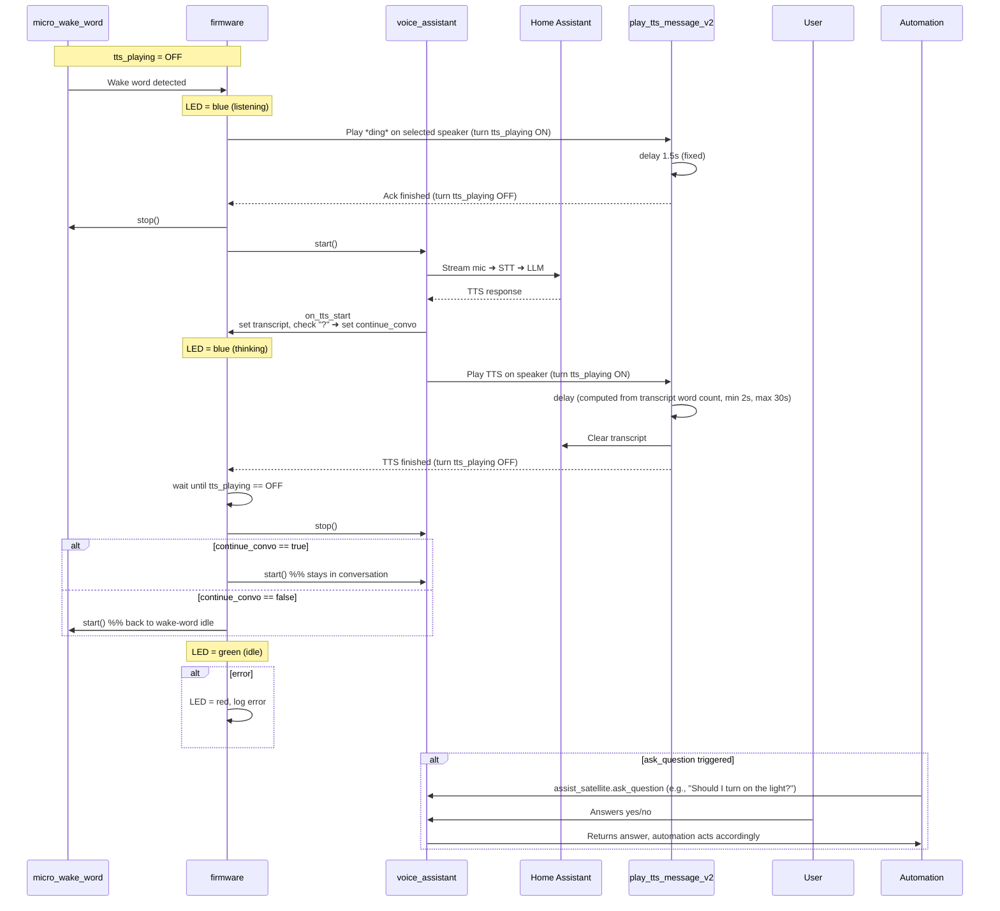

# Atom Echo – Continued-Conversation Satellite

> **Disclaimer**
> README generated by LLM  
> This firmware is a **proof of concept** and will not be a one‑click flash for most users.  
> You’ll need intermediate ESPHome & Home Assistant skills to:
> * Compile/flash your tweaked version of `atom_echo_firmware.yaml` to your Atom Echo  
> * Import and adjust `play_tts_message_v2.yaml` in Home Assistant  
> * Provide a “ding” / acknowledgement sound (host it yourself, reference its URL)  
> * Point the script at your own media‑player entities  
> * Fine‑tune any other substitutions (Wi‑Fi, encryption key, OTA password, etc.)

---

## Repository Contents

| File | Purpose |
|------|---------|
| **`atom_echo_firmware.yaml`** | ESPHome config for Atom Echo with MicroWakeWord and continued-conversation logic |
| **`device_specific_firmware.yaml`** | Device-specific ESPHome config, includes the main firmware, sets min ESPHome version, WiFi, encryption, etc. |
| **`play_tts_message_v2.yaml`** | Home Assistant script that plays TTS/ack audio, toggles `input_boolean.tts_playing`, inserts delays based on transcript word count |
| **`mww_training_w_cuda_requirements.txt`** | Python requirements for MicroWakeWord model training (TensorFlow, PyTorch, etc.) |

---

## Required Home Assistant Entities

| Entity | Type | Purpose |
|--------|------|--------|
| `input_boolean.tts_playing` | Boolean | Indicates TTS playback is active; used to gate microphone |
| `input_text.tts_transcript` | Text | Stores last TTS message for delay calculation and transcript management |

---

## Feature Highlights

* **Continued Conversation** – Automatically keeps the mic open for follow‑up questions when the response ends with a question mark.  
* **Smart TTS gating** – The helper script turns **`tts_playing` on** before audio playback and **off** after a delay so the microphone ignores the speaker.  
* **Selectable response speaker** – Choose the output zone via the **Response Speaker** dropdown in the Atom Echo *device* config (`select.response_speaker`).  
* Single‑LED feedback: idle, listening, thinking, error, with multiple custom effects (Slow Pulse, Fast Pulse, Very Fast Pulse, etc.).
* **Device-specific config** – `device_specific_firmware.yaml` sets device name, WiFi, encryption, and requires ESPHome 2025.4.0+.
* **Transcript management** – Uses `input_text.tts_transcript` to store and clear the last TTS message.
* **MicroWakeWord model training** – See `mww_training_w_cuda_requirements.txt` for dependencies if you want to train your own wake word model.
* **Ask Question Automation** – Use Home Assistant’s `assist_satellite.ask_question` service to trigger a question, wait for a spoken response, and act on the answer.

---

## Workflow: Voice Assistant, TTS, and Ask Question

---

## Key Decision Points

| Stage | Condition / Check | Action |
|-------|------------------|--------|
| **on_wake_word_detected** | `tts_playing` must be **OFF** | Prevents re‑trigger during playback |
| **on_tts_start** | Response text ends with “?” | Sets global `continue_convo` |
| **on_end** | Wait until `tts_playing` is **OFF** | Then either restart **voice_assistant** (follow‑up) or **micro_wake_word** (idle) |
| **ask_question** | Automation triggers question | Waits for user response, acts on answer |

---

## TTS Script Logic and Delay Calculation

The script `play_tts_message_media_player_v2` manages TTS playback and microphone gating:

1. Sets `tts_playing` ON before playback.
2. Plays TTS or ding sound on the selected media player.
3. Calculates delay based on transcript word count:
   - Counts words in `input_text.tts_transcript`.
   - Uses WPM (words per minute) to estimate duration:
     - `computed_delay = clamp(round(words / WPM * 60), min, max)`
     - WPM and clamp values are configurable (e.g., WPM=170, min=2s, max=30s).
   - For short responses, WPM may be increased for more accurate timing.
4. Clears transcript after playback.
5. Sets `tts_playing` OFF after the delay.

This ensures the Atom Echo does not react to its own TTS playback and resumes listening only when safe.

---

## Ask Question Automation: How It Works

- The `assist_satellite.ask_question` service lets automations/scripts send a question to a voice assistant device (satellite).
- The device asks the question (e.g., "Should I turn on the light?") and waits for the user’s spoken response.
- The automation parses the answer (yes/no or custom) and triggers actions based on the reply.
- This enables interactive, voice-driven automations (e.g., confirming actions, making choices).
- Example: After a command, the system can ask for confirmation before toggling a switch.

---

## Extending ask_question for Multi-Step Dialogs

You can chain multiple `assist_satellite.ask_question` calls in your automations to create more complex, multi-step voice dialogs. For example, after confirming an action, you can immediately ask a follow-up question and branch logic based on each response. This enables interactive, guided workflows for advanced use cases.

---

## References

* Home Assistant 2025.4 – [Continued Conversation with LLMs](https://www.home-assistant.io/blog/2025/04/02/release-20254/#continued-conversation-with-llms)  
* ESPHome MicroWakeWord component – <https://esphome.io/components/micro_wake_word.html>
* ESPHome minimum version required: **2025.4.0** (see `device_specific_firmware.yaml`)
* MicroWakeWord model training requirements: see `mww_training_w_cuda_requirements.txt`

---

*README preview generated 2025-07-27*
